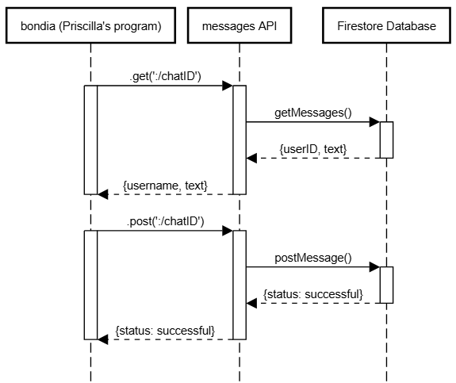

## Requesting data

To get all messages, the program should send a GET request to: 

GET http://localhost:3000/chats/:chatID.

In JavaScript, this can be done using axios as: 

```javascript

const axios = require("axios");

const chatID = "lR60apxuE8JJEPFjN7La"; // replace dynamically with the actual chatID
const url = `http://localhost:3000/chats/${chatID}`;

axios.get(url)
  .then(response => {
    console.log(response.data);
  })
  .catch(error => {
    console.log(error);
  });

```

## Receiving data

The API returns an array of JSON objects. Each object represents a message with following structure:

```json
{
  "uid": "123",
  "text": "Hello, World!"
}
```
They can be parsed and mapped to usernames using axios as follows:

```JavaScript
const axios = require("axios");

const chatID = "lR60apxuE8JJEPFjN7La"; // replace dynamically with the actual chatID
const url = `http://localhost:3000/chats/${chatID}`;

axios.get(url)
.then(response => {
  const messages = response.data;

  // format response as username: message
  messages.forEach(({username, text}) => {
    console.log(`${username}: ${text}`);
  });
```

## Sending data 

To send a message, data is sent as a POST request. The data should be structured as follows:
```json
{
  "message": {
    "uid": "123"
    "text": "Hello, world!"
  }
}
```

Example POST request using axios:

``` JavaScript

const axios = require("axios");

const chatID = "lR60apxuE8JJEPFjN7La"; // replace dynamically with the actual chatID
const url = `http://localhost:3000/chats/${chatID}`;

const user = 'LhiZknBYXixpvG814wsV' // replace this dynamically
const message = 'Hey there!'  // replace this dynamically

const data = {
    message: 
        {uid: user, text: message} 
};

axios.post(url, data)
  .then(response => {
    console.log(response.data);
  })
  .catch(error => {
    console.error(error);
  });

```
## UML Sequence Diagram:



